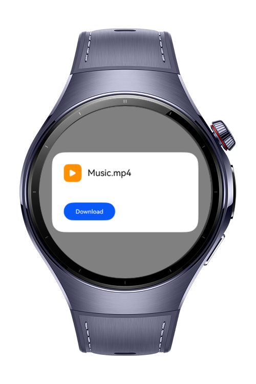
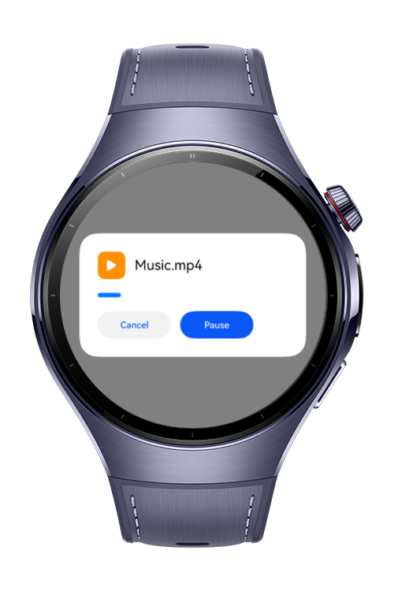

> **Note:** To access all shared projects, get information about environment setup, and view other guides, please visit [Explore-In-HMOS-Wearable Index](https://github.com/Explore-In-HMOS-Wearable/hmos-index).

# Download Center

**Download Center** is a HarmonyOS-based wearable application that simulates a file download process with background execution, transient task handling, and real-time progress notifications.

This app demonstrates key HarmonyOS capabilities such as:
- Notification templates
- Background task management
- Transient task execution
- Custom progress UI with state control

# Preview
<div>


</div>

# Use Cases

- **Simulated File Download**: Visual download bar with increasing progress over time.
- **Pause / Resume / Cancel**: Full control over the download session.
- **Notification Integration**: Dynamic progress notifications via `notificationManager`.
- **Transient Task Support**: Keeps the app alive in the background during active downloads.

# Technology
## Stack
- **Languages**: ArkTS, ArkUI
- **Frameworks**: HarmonyOS SDK 5.1.0
- **Tools**: DevEco Studio 5.1.0
- **Libraries**:
  - @kit.ArkUI
  - @kit.BackgroundTasksKit
  - @kit.NotificationKit

## Required Permissions
- ohos.permission.KEEP_BACKGROUND_RUNNING

# Directory Structure

``` 
DownloadCenter
|--- entry/src/main/ets/
| |--- common/
| | |--- utils/
| | | |--- NotificationUtil.ets
| | | |--- ResourseUtil.ets 
| | | |--- Logger.ets 
| | |--- constants/
| | |--- CommonConstants.ets 
| |
| |--- pages/
| | |--- Index.ets 
| |
| |--- resources/
| |--- screenshots/
``` 

# Constraints and Restrictions
## Supported Device
- Huawei Watch 5

# LICENSE
**Download Center** is distributed under the terms of the MIT License.
See the [license](/LICENSE) for more information.